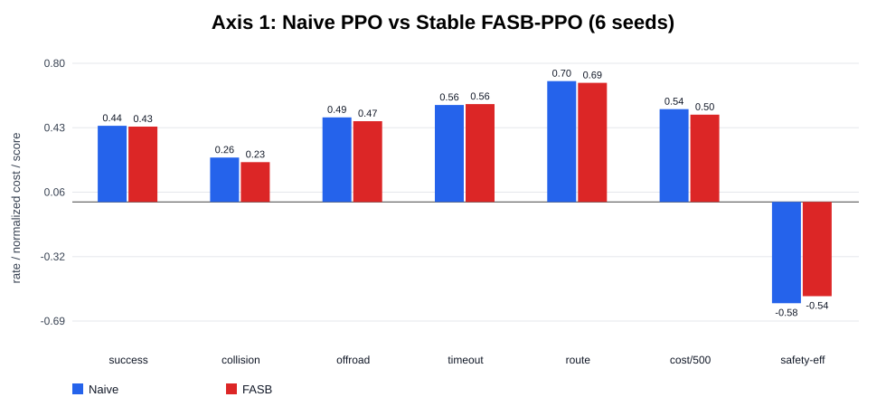
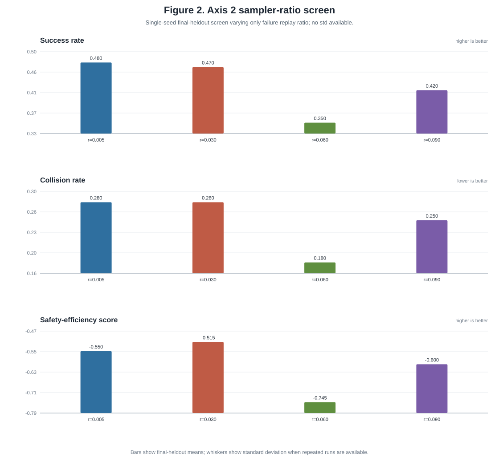
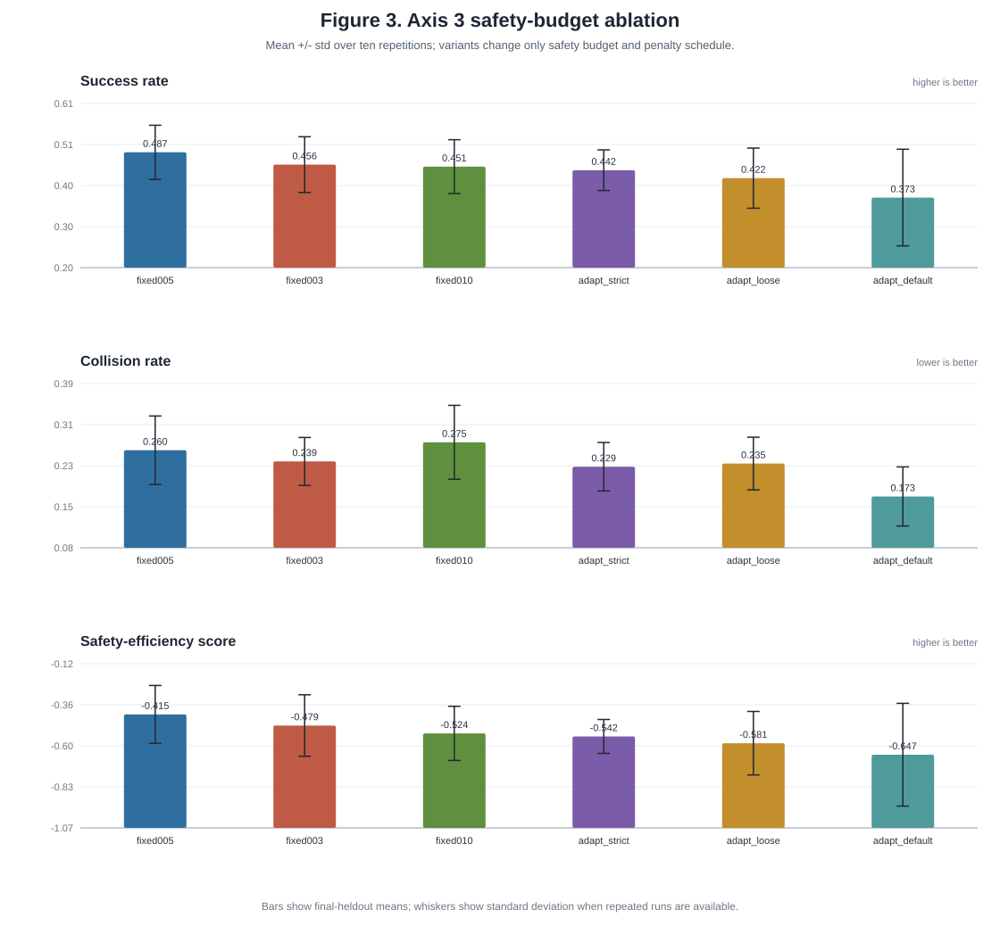
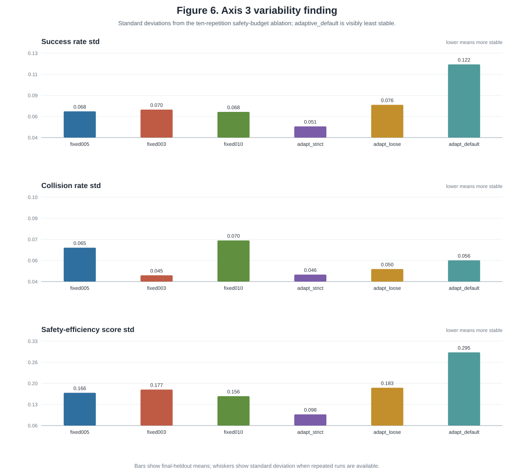
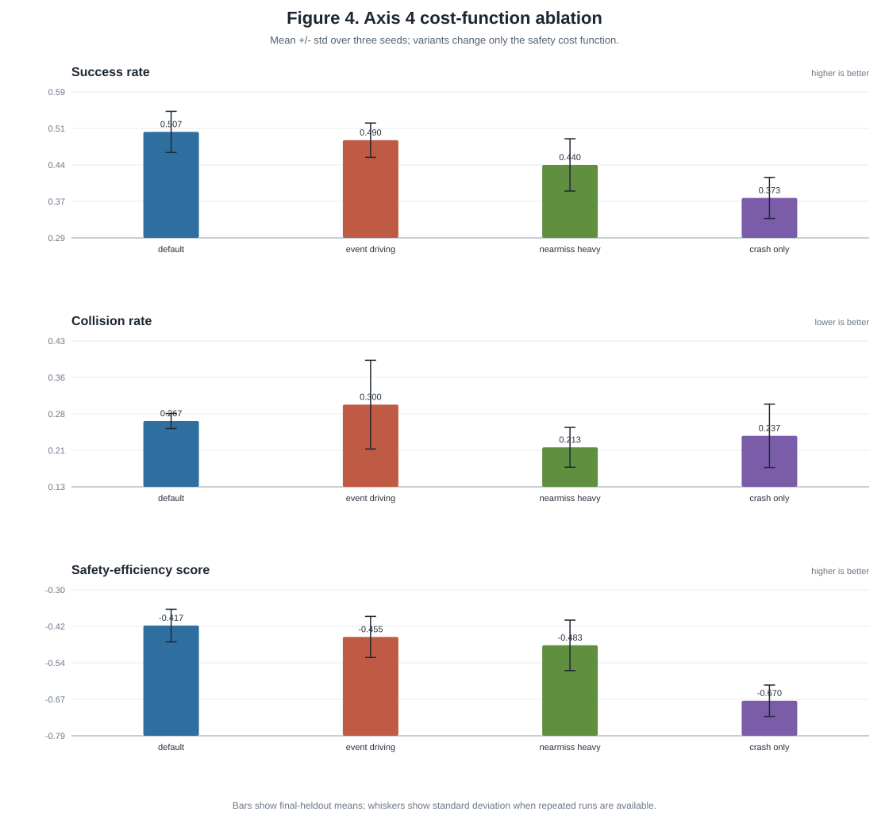
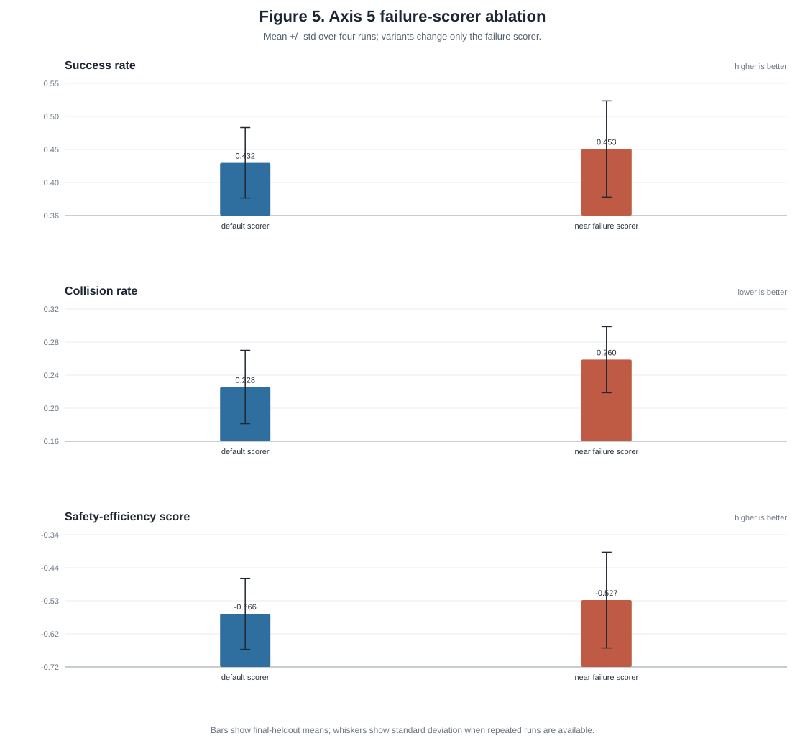

# Failure-Aware Safety Budgeting for PPO Fine-Tuning in MetaDrive

## 1. Abstract

We present a reproducible research framework for safety-budgeted reinforcement learning fine-tuning in MetaDrive. The framework, developed by our team and released at https://github.com/Ian747-tw/MetaDrive-Experiment-Framework, trains a general PPO driving agent, builds a reusable failure buffer, and studies how failure-aware sampling, safety budgets, penalty schedules, cost definitions, and failure scorers affect safety-progress tradeoffs. Our method, FASB-PPO, keeps Stable-Baselines3 PPO as the optimizer and adds a scenario-level failure sampler plus a bounded adaptive safety penalty. Across five research axes, the current stable protocol reduces average collision, offroad, and episode cost, and improves the mean safety_efficiency_score (SES), but it does not uniformly dominate naive PPO on success or route progress. The broader contribution is a controlled experiment platform: canonical artifacts, locked train/dev/test splits, dev-only checkpoint selection, plugin-based ablations, failure-mode analysis, and reviewer-ready result packages that make safety-budget research auditable rather than anecdotal.

## 2. Introduction

### 2.1 Motivation, Observation, and Contribution

Autonomous-driving reinforcement learning is a safety-progress tradeoff. A policy can complete routes while colliding or leaving the road, and it can also avoid safety costs by becoming overly conservative and timing out. Our early experiments exposed both failure modes: the original FASB setting reduced collision/offroad/cost to zero but collapsed into timeout, while later short calibration looked acceptable at 100k steps and failed at the full 300k budget. This made the main research problem concrete: safety pressure is useful only if it preserves driving progress.

This paper studies safety-budgeted PPO fine-tuning in MetaDrive. The central question is:

```text
Can failure-aware safety budgeting improve safety-efficiency over normal PPO fine-tuning while preserving route progress and avoiding timeout collapse?
```

We contribute:

- A MetaDrive research framework developed by our team, released on GitHub, for reproducible safety-budgeted PPO experiments.
- A foundation workflow that trains a general PPO driving agent and produces canonical release artifacts: a base checkpoint and a large failure buffer.
- FASB-PPO, a practical method defined as:

```text
FASB-PPO = SB3 PPO + failure-aware sampler + adaptive safety penalty
```

- A plugin system for cost functions, failure scorers, failure classifiers, samplers, safety budgets, and penalty schedulers.
- A dev-only checkpoint-selection protocol that avoids tuning on the final heldout test range.
- A five-axis experimental design separating the main method comparison from sampler, safety-budget, cost-function, and scorer/generalization ablations.
- A reviewer package under `research/research_v1/` containing paper text, configs, summary CSVs, final-evaluation CSVs, checkpoint-selection outputs, failure analyses, charts, and reproduction notes.

The framework is intended to be useful to the research community because it turns safety fine-tuning from a single reported run into an auditable protocol. Researchers can replace one component at a time, reuse the same foundation artifacts, and compare against the same locked metrics without rewriting PPO.

### 2.2 What Is Being Studied?

The topic is safety budgeting around PPO fine-tuning. A safety budget is the amount of safety cost the training procedure is willing to tolerate for a scenario or failure mode before increasing penalty pressure. It is not a hard mathematical constraint in this project. Instead, it is a bounded shaping mechanism that changes the reward seen by PPO.

Key terms:

- `success_rate`: fraction of evaluation episodes that reach the task success condition.
- `collision_rate`: fraction of episodes with vehicle/object collision.
- `offroad_rate`: fraction of episodes leaving the drivable road.
- `timeout_rate`: fraction of episodes that hit the horizon without success.
- `route_completion_mean`: mean route progress.
- `episode_cost_mean`: mean accumulated safety cost from the configured cost function.
- `safety_efficiency_score` (SES): summary score used for selection and comparison:

```text
SES = success_rate - collision_rate - offroad_rate - 0.5 * timeout_rate
```

Higher SES is better. It is interpreted together with the raw metrics because a single scalar can hide tradeoffs.

## 3. Related Work

PPO is a widely used policy-gradient algorithm that stabilizes updates through a clipped surrogate objective [1]. We keep PPO as the optimizer so that differences are attributable to sampling, safety costs, and safety budgets rather than to replacing the learning algorithm.

Safe and constrained RL methods such as Constrained Policy Optimization study explicit cost constraints [2]. OpenAI's safety exploration benchmark discussion emphasizes evaluating both task reward and safety costs [3]. Our work is related in motivation but not in formal guarantee: FASB-PPO does not solve a constrained optimization problem and should not be described as PPO-Lagrangian. It is a practical safety-budget wrapper around PPO.

MetaDrive provides procedurally generated driving scenarios for generalizable autonomous-driving RL [4]. Stable-Baselines3 provides the PPO implementation used in this project [5]. Prioritized replay motivates the idea that difficult examples can carry more learning signal [6], but our replay unit is a driving scenario rather than an individual transition.

The framework itself is open-source at our GitHub repository [7]. The source repository stores configs, scripts, tests, docs, and the reviewer package. Large generated artifacts such as checkpoints and failure buffers are not committed to git; they are distributed through the GitHub release workflow and downloaded locally for reproduction.

## 4. Methodology

### 4.1 Framework Overview

The framework has three stages:

1. Train a general PPO driving agent in MetaDrive.
2. Evaluate/explore the general agent to collect failures into a canonical failure buffer.
3. Fine-tune from the same base checkpoint with naive PPO or FASB-PPO variants, then select checkpoints on a dev range and evaluate once on final heldout.

The general agent is our own foundation policy for this project. It is trained with SB3 PPO on MetaDrive before any safety-specialized fine-tuning. The resulting base checkpoint and failure buffer are distributed through the GitHub release artifact set `research-v1-foundation-v1`, not committed as source files. After running the artifact download script, they appear locally at:

```text
runs/research_v1/base_pretrain_s42/checkpoints/final.zip
runs/research_v1/base_explore_large/buffers/failure_buffer.jsonl
```

These local `runs/` paths are generated or downloaded during reproduction. They are intentionally not stored in the remote source tree.

### 4.2 FASB-PPO Objective

The PPO backbone uses the clipped objective [1]:

```text
L_clip(theta) = E_t[min(r_t(theta) A_t,
                       clip(r_t(theta), 1 - eps, 1 + eps) A_t)]
```

where `r_t(theta)` is the policy probability ratio and `A_t` is the advantage estimate.

FASB-PPO changes the reward passed to PPO:

```text
r'_t = r_t - lambda_i * c_t
```

where `r_t` is the original environment reward, `c_t >= 0` is the safety cost at step `t`, and `lambda_i` is the scenario-level penalty coefficient computed at reset for scenario `i`. The step cost `c_t` comes from the active cost-function plugin, such as `DefaultDrivingCost`, `CrashOnlyCost`, `NearMissHeavyCost`, or `EventDrivingCost`. The wrapper validates non-negative costs but does not normalize or clip them. Therefore `episode_cost_mean` is an accumulated cost and is most comparable when horizon and evaluation protocol are fixed, as they are within each axis.

The adaptive safety budget is:

```text
d_i = timeout_budget,                         if failure mode is timeout/low-progress
d_i = d_max - (d_max - d_min) * risk_i,       otherwise
```

The penalty scheduler is:

```text
lambda_i = max(0, (lambda_min + (lambda_max - lambda_min) * risk_i) * m_i)
```

where `risk_i` is the failure score in `[0, 1]` and `m_i` is a failure-mode multiplier. Higher risk therefore produces a stronger penalty.

Implementation note. The current `RiskPenaltyScheduler` receives the budget object and records `d_i` in metadata, but its default coefficient is risk/mode based rather than a primal-dual update from `(cost - d_i)`. Thus `d_i` is part of the component interface and experiment logging, while the active reward shaping is controlled directly by `lambda_i * c_t`. Axis 3 should therefore be read as a safety-budget/penalty component ablation, not as evidence for formal constrained optimization.

The failure-aware sampler chooses scenarios as:

```text
P(use failure buffer) = failure_ratio
P(select failure j | buffer) proportional to priority_j^alpha
```

Otherwise, it samples a random MetaDrive scenario from the active training range.

### 4.3 Coefficients and Expected Effects

| coefficient | value in stable default | meaning | expected effect |
| --- | ---: | --- | --- |
| `learning_rate` | `0.00003` | PPO optimizer step size | Lower than the old default; reduces destructive fine-tuning and stabilizes checkpoint selection. |
| `failure_ratio` | `0.05` | Probability of replaying a failure-buffer scenario | Higher values increase failure specialization but can overfit or reduce progress. Axis 2 shows high replay is risky. |
| `alpha` | `0.7` | Priority sharpness inside the failure buffer | Larger values emphasize high-priority failures more strongly. |
| `max_too_hard_ratio` | `0.15` | Cap on overly difficult replay cases | Prevents replay from being dominated by failures the current policy cannot learn from. |
| `d_min` | `0.10` | Minimum adaptive safety budget | Sets the lower bound of the budget reported to the scheduler/logs; only affects penalty strength when the selected scheduler uses the budget value directly. |
| `d_max` | `0.30` | Maximum adaptive safety budget | Sets the upper bound of the reported adaptive budget; useful for budget ablations and scheduler variants. |
| `timeout_budget` | `0.30` | Budget for timeout/low-progress cases | Separates progress failures from collision/offroad failures in the budget interface. |
| `lambda_min` | `0.0` | Minimum penalty coefficient | Allows low-risk scenarios to receive no extra safety penalty. |
| `lambda_max` | `0.25` | Maximum base penalty coefficient | Bounds the cost penalty so the policy does not freeze. |

### 4.4 Active Experimental Protocol

All active final experiments use the same foundation assets unless the axis explicitly changes one variable.

| component | setting |
| --- | --- |
| Base checkpoint | GitHub release artifact; local path after download shown in Section 4.1 |
| Canonical failure buffer | GitHub release artifact; local path after download shown in Section 4.1 |
| Optimizer | SB3 PPO, CPU |
| Fine-tuning budget | `300000` timesteps |
| Learning rate | `0.00003` |
| Training scenarios | `num_scenarios=500`, horizon `500`, traffic density `0.1` |
| Dev checkpoint selection | `start_seed=4500`, `num_scenarios=100`, 100 episodes |
| Final heldout evaluation | `start_seed=5000`, `num_scenarios=200`, 100 episodes |

The selected checkpoint maximizes `safety_efficiency_score` on dev unless it violates hard progress filters:

```text
success_rate < 0.20
route_completion_mean < 0.40
timeout_rate > 0.80
```

These thresholds are engineering guardrails against selecting a checkpoint that obtains a high-looking SES only by freezing or making negligible route progress. They were not tuned on final heldout. A full sensitivity analysis over thresholds is future work; for this study the thresholds are fixed before final evaluation and applied uniformly across methods.

Evaluation uses `eval.n_episodes` rollouts. For each rollout `i`, the evaluator resets MetaDrive with a deterministic scenario seed from the configured range starting at `start_seed`. Thus dev uses 100 rollouts over the dev seed range, while final heldout uses 100 rollouts drawn from a larger 200-scenario heldout range; the 200-scenario setting defines the scenario pool, not the number of rollouts.

The final heldout range is used only after selection.

### 4.5 Axes

| axis | research variable | fixed controls |
| --- | --- | --- |
| Axis 1 | Naive PPO vs stable FASB-PPO | Same base checkpoint, optimizer, training budget, checkpoint selection, and final heldout. The current fair multiseed Axis 1 does not include fixed-budget PPO. |
| Axis 2 | Failure sampler ratio | Budget, penalty, cost, scorer, optimizer, checkpoint selection. |
| Axis 3 | Safety budget and penalty schedule | Sampler, cost, scorer, optimizer, checkpoint selection. |
| Axis 4 | Safety cost function | Sampler, budget, penalty, scorer, optimizer, checkpoint selection. |
| Axis 5 | Failure scorer and traffic-density shift | Sampler, budget, penalty, cost, optimizer, checkpoint selection. |

## 5. Experiments

### 5.1 Reading the Figures

All central figures include success rate, collision rate, and safety_efficiency_score (SES). Unless otherwise stated, bars are means over repeated final-heldout evaluations and whiskers are standard deviations. Axis 2 currently reports point estimates from the available final-heldout runs, so it has no whiskers. Higher is better for success and SES; lower is better for collision.

### 5.2 Axis 1: Main Comparison

Axis 1 compares normal PPO fine-tuning against stable FASB-PPO. The fair multiseed comparison uses naive PPO and FASB-PPO only; fixed-budget PPO is discussed elsewhere as a safety-budget ablation and is not part of the current Axis 1 paired table.



Figure 1 shows mean +/- std over six paired training seeds, with checkpoints selected on dev and evaluated once on final heldout.

| method | success | collision | offroad | timeout | route | cost | safety_efficiency_score (SES) |
| --- | ---: | ---: | ---: | ---: | ---: | ---: | ---: |
| Naive PPO | 0.440 +/- 0.041 | 0.257 +/- 0.056 | 0.488 +/- 0.060 | 0.560 +/- 0.041 | 0.6981 +/- 0.0327 | 267.99 +/- 17.71 | -0.585 +/- 0.123 |
| Stable FASB-PPO | 0.435 +/- 0.034 | 0.230 +/- 0.042 | 0.467 +/- 0.045 | 0.565 +/- 0.034 | 0.6879 +/- 0.0189 | 252.10 +/- 6.00 | -0.544 +/- 0.060 |

Direction-aware paired summary over six seeds:

| metric | mean FASB - naive delta | FASB wins | ties | naive wins |
| --- | ---: | ---: | ---: | ---: |
| safety_efficiency_score | +0.0408 | 2 | 1 | 3 |
| success_rate | -0.0050 | 2 | 0 | 4 |
| collision_rate | -0.0267 | 3 | 1 | 2 |
| offroad_rate | -0.0217 | 4 | 0 | 2 |
| timeout_rate | +0.0050 | 2 | 0 | 4 |
| route_completion_mean | -0.0102 | 2 | 0 | 4 |
| episode_cost_mean | -15.8850 | 5 | 0 | 1 |

Interpretation. FASB-PPO avoids the earlier timeout collapse and shifts the policy toward safety: lower mean collision, lower offroad, lower cost, and better mean SES. However, the paired result is not a robust win because naive PPO is slightly better on mean success, timeout, and route completion, and FASB wins SES on only two of six seeds. The lesson is that safety-budgeted fine-tuning can improve safety pressure without freezing, but it should be reported as a tradeoff rather than a universal improvement over PPO.

The standard deviations are also informative. FASB has lower SES variance than naive PPO (`0.060` vs `0.123`) and much lower cost variance (`6.00` vs `17.71`), suggesting the stable protocol produces more consistent safety-cost behavior even though it does not dominate success.

### 5.3 Axis 2: Failure Sampler Ratio

Axis 2 varies only `failure_ratio`. It asks whether more failure replay improves specialization or causes overfitting/conservatism.



Figure 2 shows that aggressive failure replay can hurt the success rate; bars are final-heldout point estimates from the available Axis 2 runs.

| variant | failure ratio | success | collision | offroad | timeout | route | cost | safety_efficiency_score (SES) |
| --- | ---: | ---: | ---: | ---: | ---: | ---: | ---: | ---: |
| mixed005 | 0.05 | 0.48 | 0.28 | 0.49 | 0.52 | 0.7067 | 260.50 | -0.550 |
| mixed030 | 0.30 | 0.47 | 0.28 | 0.44 | 0.53 | 0.6978 | 239.82 | -0.515 |
| mixed060 | 0.60 | 0.35 | 0.18 | 0.59 | 0.65 | 0.6298 | 277.59 | -0.745 |
| mixed090 | 0.90 | 0.42 | 0.25 | 0.48 | 0.58 | 0.7004 | 253.22 | -0.600 |

Interpretation. Moderate replay (`0.30`) gives the best SES and cost in the available Axis 2 results, while high replay (`0.60`) sharply reduces success and route completion. The likely mechanism is distribution imbalance: too much replay concentrates training on difficult failures and weakens broad driving behavior. The constructive lesson is to keep failure replay controlled and validate any larger replay ratio before adopting it as a default.

### 5.4 Axis 3: Safety Budget and Penalty

Axis 3 is the core safety-budget axis. It varies only the budget and penalty scheduler while keeping sampler, cost, scorer, optimizer, checkpoint selection, and evaluation fixed.



Figure 3 shows mean +/- std over ten repetitions.

| variant | success | collision | offroad | timeout | route | cost | safety_efficiency_score (SES) |
| --- | ---: | ---: | ---: | ---: | ---: | ---: | ---: |
| fixed005 | 0.487 +/- 0.068 | 0.260 +/- 0.065 | 0.386 +/- 0.069 | 0.513 +/- 0.068 | 0.7067 +/- 0.0395 | 244.83 +/- 20.56 | -0.416 +/- 0.166 |
| fixed003 | 0.456 +/- 0.070 | 0.239 +/- 0.045 | 0.424 +/- 0.085 | 0.545 +/- 0.071 | 0.7083 +/- 0.0364 | 252.41 +/- 24.58 | -0.480 +/- 0.177 |
| fixed010 | 0.451 +/- 0.068 | 0.275 +/- 0.070 | 0.426 +/- 0.083 | 0.549 +/- 0.068 | 0.6950 +/- 0.0249 | 252.82 +/- 21.27 | -0.525 +/- 0.156 |
| adaptive_strict | 0.442 +/- 0.051 | 0.229 +/- 0.046 | 0.475 +/- 0.062 | 0.560 +/- 0.051 | 0.6818 +/- 0.0385 | 246.60 +/- 16.16 | -0.542 +/- 0.098 |
| adaptive_loose | 0.422 +/- 0.076 | 0.235 +/- 0.050 | 0.479 +/- 0.095 | 0.578 +/- 0.076 | 0.6689 +/- 0.0365 | 271.73 +/- 20.76 | -0.581 +/- 0.183 |
| adaptive_default | 0.373 +/- 0.122 | 0.173 +/- 0.056 | 0.534 +/- 0.154 | 0.627 +/- 0.122 | 0.6669 +/- 0.0342 | 275.03 +/- 48.84 | -0.648 +/- 0.295 |



Figure 4 shows the clearest standard-deviation finding: the adaptive default has much higher SES variance than the best fixed budget.

Interpretation. The current adaptive-budget implementation is not supported by this suite. This does not contradict the framework design: FASB exposes a budget component, but the default scheduler uses risk and failure mode rather than a direct `(cost - budget)` feedback update. Under this implementation, `fixed005` is the best budget/penalty configuration: it has the highest success, lowest offroad, lowest cost, and best SES. The adaptive default has the lowest collision rate, but that is not a useful win because it also has the highest timeout and worst SES; it appears to avoid collisions partly by reducing productive driving. The lesson for future FASB work is to either use a simple fixed penalty budget or implement a scheduler that explicitly maps budget violation into `lambda_i`, then test it under the same protocol.

### 5.5 Axis 4: Cost Function

Axis 4 varies only the safety cost function.



Figure 5 shows mean +/- std over three seeds.

| cost function | success | collision | offroad | timeout | route | cost | safety_efficiency_score (SES) |
| --- | ---: | ---: | ---: | ---: | ---: | ---: | ---: |
| DefaultDrivingCost | 0.507 +/- 0.042 | 0.267 +/- 0.015 | 0.410 +/- 0.062 | 0.493 +/- 0.042 | 0.7138 +/- 0.0314 | 251.22 +/- 13.95 | -0.417 +/- 0.055 |
| EventDrivingCost | 0.490 +/- 0.035 | 0.300 +/- 0.090 | 0.390 +/- 0.062 | 0.510 +/- 0.035 | 0.7018 +/- 0.0299 | 237.74 +/- 6.33 | -0.455 +/- 0.069 |
| NearMissHeavyCost | 0.440 +/- 0.053 | 0.213 +/- 0.040 | 0.430 +/- 0.010 | 0.560 +/- 0.053 | 0.6922 +/- 0.0286 | 266.02 +/- 11.18 | -0.483 +/- 0.085 |
| CrashOnlyCost | 0.373 +/- 0.042 | 0.237 +/- 0.064 | 0.493 +/- 0.055 | 0.627 +/- 0.042 | 0.6677 +/- 0.0314 | 267.50 +/- 9.43 | -0.670 +/- 0.053 |

Interpretation. `DefaultDrivingCost` is the best balanced cost. `NearMissHeavyCost` lowers collisions but increases timeout and lowers success, which is the same conservatism pattern seen in failed FASB settings. `CrashOnlyCost` performs worst because sparse crash/offroad feedback gives too little pre-crash learning signal. `EventDrivingCost` gives the lowest episode cost but raises collision variance. The constructive lesson is that cost design should include enough shaping to warn before failure, but not so much near-miss pressure that the policy hesitates.

### 5.6 Axis 5: Failure Scorer and Generalization

Axis 5 varies the failure scorer and adds a small traffic-density shift study.



Figure 6 shows mean +/- std over four runs.

| scorer | success | collision | offroad | timeout | route | cost | safety_efficiency_score (SES) |
| --- | ---: | ---: | ---: | ---: | ---: | ---: | ---: |
| NearFailureScorer | 0.453 +/- 0.070 | 0.260 +/- 0.039 | 0.445 +/- 0.058 | 0.550 +/- 0.067 | 0.6872 +/- 0.0311 | 252.78 +/- 13.44 | -0.528 +/- 0.134 |
| DefaultFailureScorer | 0.433 +/- 0.051 | 0.228 +/- 0.044 | 0.488 +/- 0.045 | 0.568 +/- 0.051 | 0.6813 +/- 0.0248 | 256.29 +/- 19.57 | -0.566 +/- 0.100 |

Paired near-failure-minus-default deltas:

| seed | delta SES | delta success | delta collision | delta offroad | delta timeout | delta cost |
| --- | ---: | ---: | ---: | ---: | ---: | ---: |
| 42 | +0.130 | +0.08 | +0.11 | -0.12 | -0.08 | +3.63 |
| 2000 | -0.150 | -0.08 | +0.04 | -0.01 | +0.08 | -1.25 |
| 3000 | -0.015 | +0.01 | -0.01 | +0.04 | -0.01 | +11.03 |
| 4000 | +0.190 | +0.07 | -0.01 | -0.08 | -0.06 | -27.44 |

Interpretation. `NearFailureScorer` is marginally better on mean SES, success, offroad, timeout, route, and cost, but it is not robust by paired comparison: SES is 2 wins and 2 losses. It also increases mean collision. This suggests failure scoring is a second-order knob under the current protocol. The likely reason is that scorer changes affect which failures are prioritized, but the budget, cost function, and PPO optimizer still dominate the final behavior. Future scorer work should use stronger classifier validation or combine near-failure signals with explicit collision-risk controls.

### 5.7 Cross-Axis Synthesis

| axis | main finding | research lesson |
| --- | --- | --- |
| Axis 1 | FASB improves average safety/cost but not paired dominance. | Safety-budgeted PPO should be reported as a tradeoff, not a blanket improvement. |
| Axis 2 | Aggressive replay hurts success in the available runs. | Failure replay should remain controlled and should be validated before adoption. |
| Axis 3 | Fixed budget `0.05` beats the current adaptive-budget variants. | The active scheduler does not directly optimize budget violation; simple fixed penalties are stronger in this implementation. |
| Axis 4 | Default cost is best balanced. | Cost shaping is load-bearing; overly sparse or overly conservative costs hurt progress. |
| Axis 5 | Near-failure scoring is marginal and not robust. | Scorer design matters, but it is weaker than budget and cost choices in this framework. |

Across axes, the strongest empirical conclusion is that safety-budgeted PPO is sensitive to how safety pressure is introduced. More replay, more adaptivity, or heavier near-miss shaping does not automatically improve driving. The framework contribution is that these conclusions are visible because every axis changes one component while preserving the same foundation assets, selection protocol, and final metrics.

## 6. Conclusion

This project develops a professional, reproducible framework for safety-budgeted PPO fine-tuning in MetaDrive. It includes our own trained general driving agent, canonical release artifacts, failure-buffer reuse, component validation, plugin-based FASB modules, dev-only checkpoint selection, and reviewer-ready result organization.

The empirical findings are measured. Axis 1 shows stable FASB-PPO improves average safety/cost metrics but does not robustly beat naive PPO on paired success and progress. Axis 2 shows aggressive failure replay can hurt success. Axis 3 shows the current adaptive budget/scheduler combination is weaker than a simple fixed budget of `0.05`, partly because the active scheduler does not directly update `lambda_i` from budget violation. Axis 4 shows default cost shaping is the best balanced cost signal. Axis 5 shows near-failure scoring is only marginally helpful and not robust across paired runs.

The main contribution is not a claim that FASB-PPO solves safe driving RL. The contribution is a reusable research framework and a disciplined protocol for testing safety-budget mechanisms around PPO. For the community, this is useful because it makes common safe-RL failure modes visible: timeout collapse, optimizer confounds, final-test over-selection, and misleading single-metric safety wins.

## 7. Member Workload

Camera-ready version only. Fill this section with team member names and contributions.

| member | contribution |
| --- | --- |
| TBD | Framework implementation / training / analysis / writing |
| TBD | Axis 2 sampler experiments |
| TBD | Axis 3 safety-budget experiments |
| TBD | Axis 4 cost-function experiments |
| TBD | Axis 5 scorer/generalization experiments |

## 8. References

[1] John Schulman, Filip Wolski, Prafulla Dhariwal, Alec Radford, and Oleg Klimov. "Proximal Policy Optimization Algorithms." arXiv:1707.06347, 2017. https://arxiv.org/abs/1707.06347

[2] Joshua Achiam, David Held, Aviv Tamar, and Pieter Abbeel. "Constrained Policy Optimization." arXiv:1705.10528, 2017. https://arxiv.org/abs/1705.10528

[3] Alex Ray, Joshua Achiam, and Dario Amodei. "Benchmarking Safe Exploration in Deep Reinforcement Learning." OpenAI, 2019. https://openai.com/index/benchmarking-safe-exploration-in-deep-reinforcement-learning

[4] Quanyi Li, Zhenghao Peng, Lan Feng, Qihang Zhang, Zhenghai Xue, and Bolei Zhou. "MetaDrive: Composing Diverse Driving Scenarios for Generalizable Reinforcement Learning." arXiv:2109.12674, 2021. https://arxiv.org/abs/2109.12674

[5] Antonin Raffin, Ashley Hill, Adam Gleave, Anssi Kanervisto, Maximilian Ernestus, and Noah Dormann. "Stable-Baselines3: Reliable Reinforcement Learning Implementations." Journal of Machine Learning Research, 22(268):1-8, 2021. https://jmlr.org/papers/v22/20-1364.html

[6] Tom Schaul, John Quan, Ioannis Antonoglou, and David Silver. "Prioritized Experience Replay." arXiv:1511.05952, 2015. https://arxiv.org/abs/1511.05952

[7] Ian747-tw and collaborators. "MetaDrive-Experiment-Framework." GitHub repository, 2026. https://github.com/Ian747-tw/MetaDrive-Experiment-Framework

## 9. Appendices

### Appendix A: Reviewer Package

```text
research/research_v1/
research/research_v1/charts/
research/research_v1/axis1/results/
research/research_v1/axis2/results/
research/research_v1/axis3/reports/
research/research_v1/axis4/reports/
research/research_v1/axis5/reports/
```

### Appendix B: Active Config Families

```text
configs/research_v1/axis1_naive_stable_final.yaml
configs/research_v1/axis1_fasb_stable_final.yaml
configs/research_v1/axis2_sampler_mixed060_final.yaml
configs/research_v1/axis3_budget_adaptive_default_final.yaml
configs/research_v1/axis3_budget_fixed_default_final.yaml
configs/research_v1/axis4_cost_default_final.yaml
configs/research_v1/axis5_default_scorer_final.yaml
configs/research_v1/axis5_near_failure_scorer_final.yaml
```

### Appendix C: Reproduction Notes

The source repository does not commit large `runs/` artifacts. Reviewers reproduce the local run layout by downloading the GitHub release artifacts, especially `research-v1-foundation-v1`, and then running the listed configs. The paper package contains result CSVs and charts so the reported claims can be checked without re-running every 300k-step training job.
